# 🧩 Escape Room Booking API

### Overview
A minimal **FastAPI + SQLite** project implementing an *escape room booking system* with 5-minute hold/expiration logic and race-condition-safe booking.

---

### 🤖 AI Assistance

This project was developed with the help of **ChatGPT (GPT-5)** for specific parts of the workflow.  
AI assistance was used to:
- Generate initial **project boilerplate** (FastAPI setup, directory structure, `db.py`, and `models.py` scaffolding)
- Draft **example API endpoints** (`/slots`, `/holds`, `/holds/{id}/confirm`, `/holds/{id}/release`)
- Create **SQLite-friendly SQL queries** and ensure transactional safety
- Provide **test cases and curl commands** for verification
- Refine the **README documentation** and improve clarity and formatting

All application logic, debugging, and verification were performed manually,  
and the final implementation was tested locally to confirm correctness and behavior.

---

## 🚀 Quick Start

### 1️⃣ Setup environment
```bash
cd escape-room-api
python -m venv venv && source venv/bin/activate
pip install -r requirements.txt
```

### 2️⃣ Run API server
```bash
uvicorn app.main:app --reload
```
Visit → [http://127.0.0.1:8000](http://127.0.0.1:8000)

---

## 🧱 Project Structure
```
escape-room-api/
├─ app/
│   ├─ main.py           # FastAPI entry point
│   ├─  db.py            # DB engine setup + seed data
│   ├─  models.py        # ORM models
├─ routers/
│   ├─ holds.py          # /holds endpoints (create, confirm, release)
│   └─ slots.py          # /slots endpoints (list user-aware availability)
├─ tests/
│   └─ test_holds.py     # pytest
└─ requirements.txt
```

---

## 🗃 Database Schema
| Table | Purpose | Key Fields |
|--------|----------|-------------|
| **users** | demo users | `id`, `name`, `email` |
| **rooms** | escape rooms | `id`, `name`, `capacity` |
| **time_slots** | bookable time windows per room | `id`, `room_id`, `start_time`, `end_time`, `is_booked` |
| **holds** | temporary reservations | `id`, `slot_id`, `user_id`, `status`, `expires_at` |

---

## ⚙️ API Endpoints

### `GET /slots`
List slots for a given room.  
Supports optional `user_id` for **user-aware statuses**:
- `BOOKED`: confirmed booking
- `HELD_BY_ME`: user currently holds this slot (not expired)
- `HELD_BY_OTHER`: another user holds it (not expired)
- `AVAILABLE`: free to hold

Example:
```bash
GET /slots?room_id=r-101&user_id=u-demo
```

---

### `POST /holds`
Create a **5-minute hold** for a given `slot_id` and `user_id`.

#### Request
```json
{
  "slot_id": "s-1",
  "user_id": "u-demo"
}
```
#### Response `201`
```json
{
  "hold_id": "uuid",
  "status": "HOLD",
  "expires_at": "2025-10-22T03:15:00Z"
}
```
> Uses single-statement SQL (`INSERT ... SELECT ... WHERE NOT EXISTS`) for atomic race-safe creation.

---

### `POST /holds/{hold_id}/confirm`
Confirm a valid (non-expired) hold → marks slot as booked.

#### Request
```json
{
  "user_id": "u-demo"
}
```
#### Response
```json
{
  "hold_id": "uuid",
  "slot_id": "s-1",
  "status": "CONFIRMED"
}
```

---

### `POST /holds/{hold_id}/release`
Release a hold (by owner only).
#### Request
```json
{
  "user_id": "u-demo"
}
```
#### Response
```json
{
  "hold_id": "uuid",
  "status": "RELEASED"
}
```

---

## 💡 Expiration Logic (Lazy Expiration)
- Each hold lasts **5 minutes** (`expires_at = now + 5m`).
- No background job required.
- Any query/update ignores holds where `expires_at <= now()`.
- Ensures correctness even if background cleanup is never run.

---
## 🧪 API Test Scenarios

This section describes the main test cases for the **Slot Booking & Hold** system.

---

### 🔹 Basic Flow

1. **List available slots**
   1. **List available slots**  
   - `GET /slots` → should return all available (non-held, non-booked) slots.  
   - The first image shows results **without** `user_id`; the second includes `user_id`, which highlights which slots are held or booked by the current user.  
   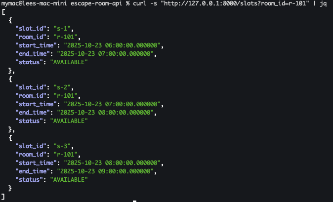  
   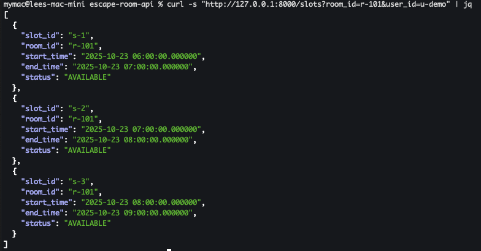  
   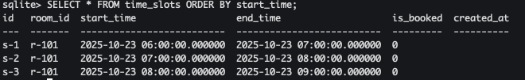

2. **Create → Confirm / Release → Book Flow**  
   - Create a hold for a slot → confirm the hold → verify booking success.  
   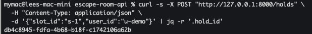  
     
   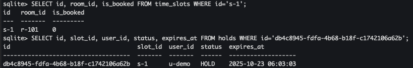  
   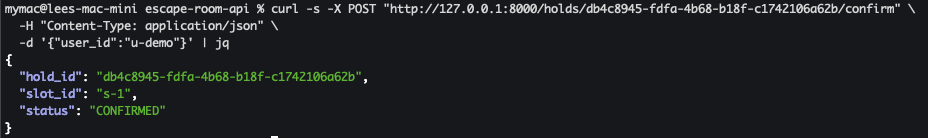  
   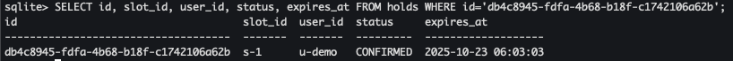  
   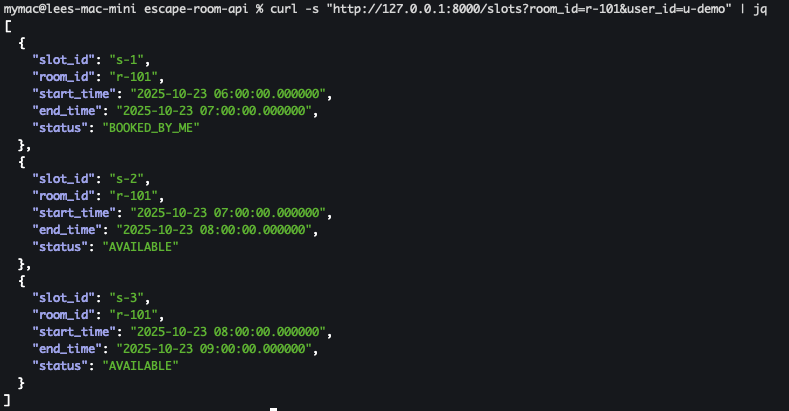  
   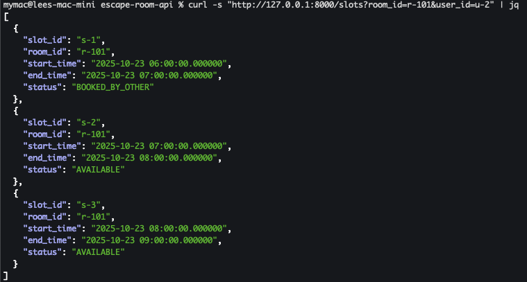

   - **Alternative path:** release the hold instead of confirming.  
   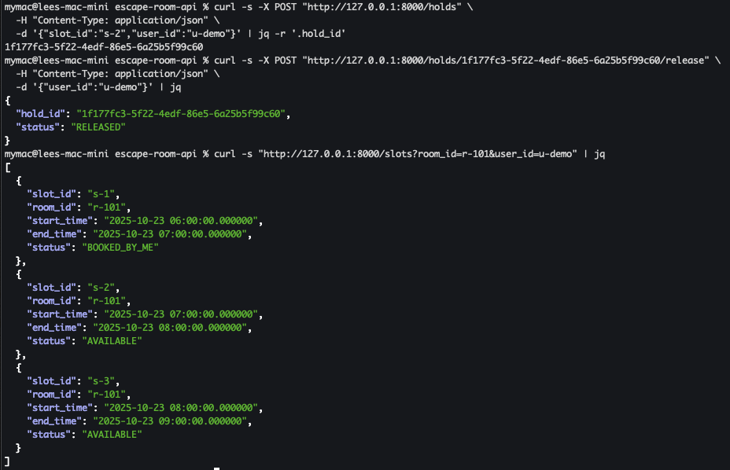  
   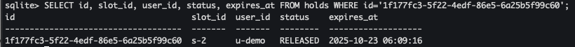

   - **Test both:**  
     - Booking confirmed by the same user  
     - Booking attempted by another user (should be rejected)  
     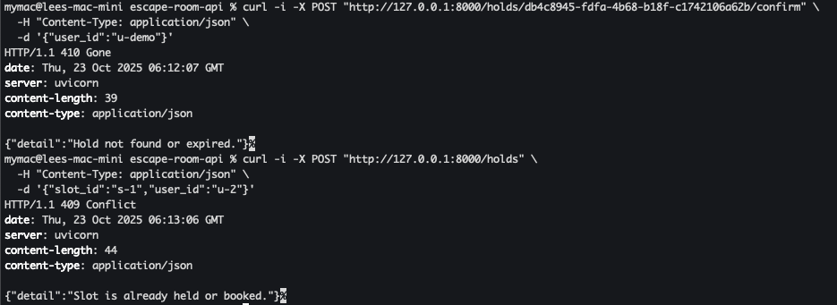

3. **Concurrent Holds**  
   - `user_1` creates a hold on a slot.  
   - `user_2` tries to create a hold for the same slot → **rejected**.  
   - Any attempt to hold a slot that is already **held** or **booked** → **rejected**.

---

### 🔸 **A. Expiration**

1. **Lazy Expiration**  
   - When a hold expires, the slot should become available again for others to book.  
   - Attempting to create a hold after expiration should succeed.  
   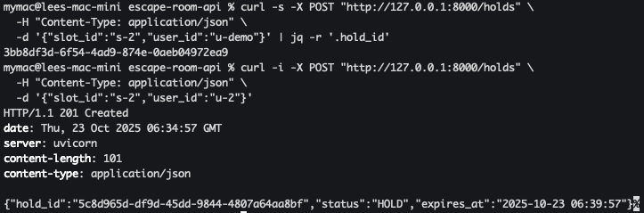  
   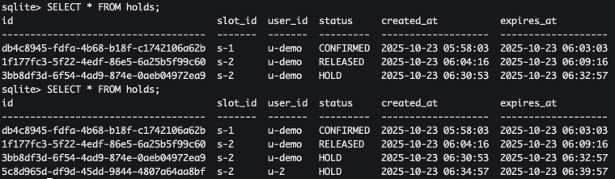

2. **Confirm Expired Hold**  
   - Confirming an already expired hold should return **410 Gone**, indicating the hold is no longer valid.  
   - Expected response: `"Hold not found or expired."`  
   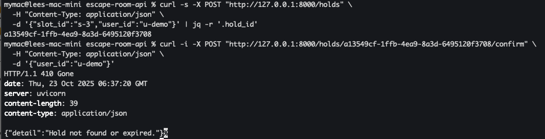  
   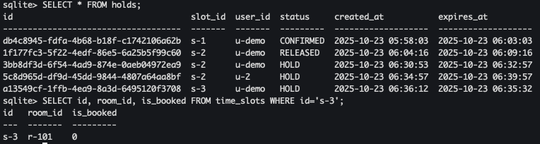

---

### 🔸 B. Ownership

1. **Confirm Another User's Hold**
   - Attempting to confirm a hold not owned by the user → **rejected**.

2. **Release Another User's Hold**
   - Attempting to release a hold not owned by the user → **rejected**.

---

### 🔸 C. Idempotency

1. **Double Confirm**
   - Confirming the same hold twice → second confirmation should be **idempotent** (no error, or no-op).

2. **Release Confirmed Hold**
   - Releasing a hold that is already confirmed/booked → should be **rejected** or **no-op**, depending on design.

---

### 🔸 D. Validation

1. **Missing Required Fields**
   - Send a malformed request (e.g. `POST /holds` without required fields) → should return validation error.

---

### 🔸 E. Visibility

1. **User-aware Slot Status**
   - `GET /slots` should include:
     - `HELD_BY_ME` — slots held by the current user.
     - `HELD_BY_OTHER` — slots held by other users.


## 🧪 Running Tests
```bash
pytest -q
```

Key test cases:
1. **Basic Flow** — create → confirm → verify booked.
2. **Conflict Handling** — two users attempt same slot → second gets 409 Conflict.

---

## 🧠 Design Notes
- **Concurrency safety**: implemented via single SQL atomic conditions.
- **Lazy expiration**: avoids background jobs.
- **User-awareness**: `/slots` reports `HELD_BY_ME` vs `HELD_BY_OTHER`.
- **Simple setup**: SQLite included; no external dependency.
- **Extensible**: easy to upgrade to Postgres by changing connection URL.

---

## 🧰 Future Enhancements
- Add `pg_cron` or Redis TTL-based real-time expiration.
- Enforce uniqueness via partial index (`WHERE status='HOLD' AND expires_at>now()`).
- Add `/holds/{id}/extend` endpoint (optional 1-time extension).
- Add room-level filtering & pagination for `/slots`.
